Today I officially graduate from Specialist Cadet School as a sergeant! It has been a memorable 6 months and here are some pictures I wanted to share.

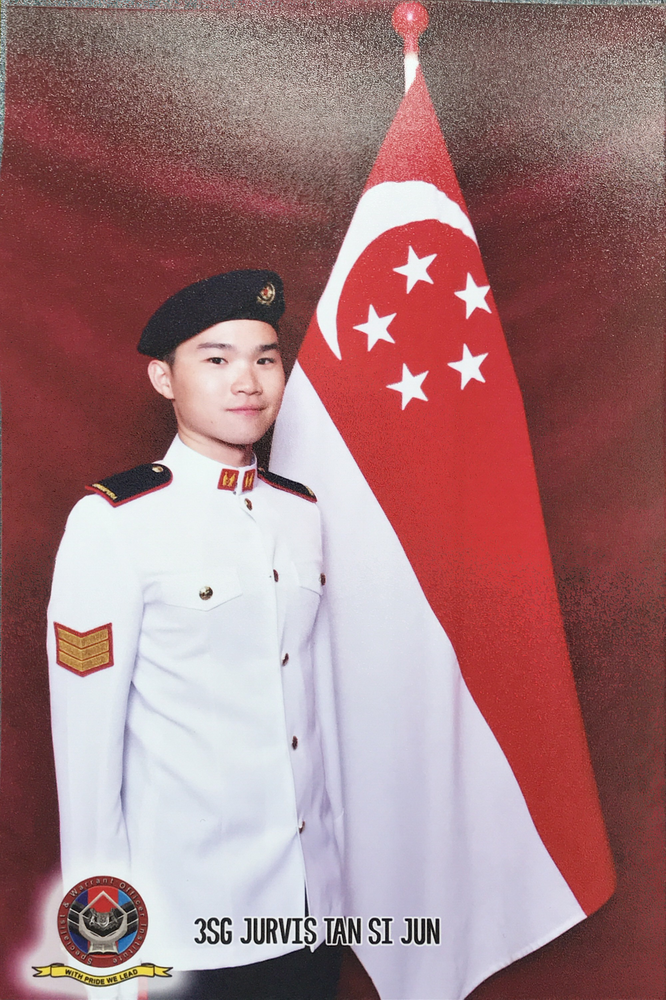

For graduating from cadet school as one of it's top cadets, I get some shiny things to add to my trophy case

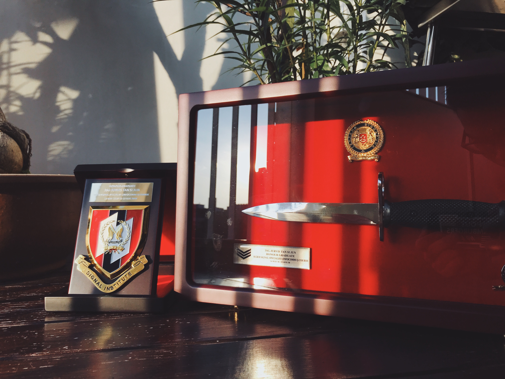

The graduation parade. Speech was long and perilous 😱

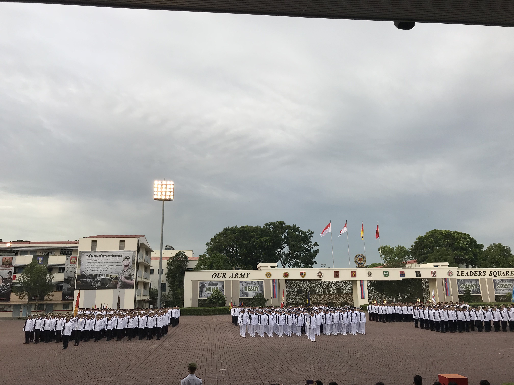

Led my contingent up front as contingent commander -- it felt pretty awesome, I must say.

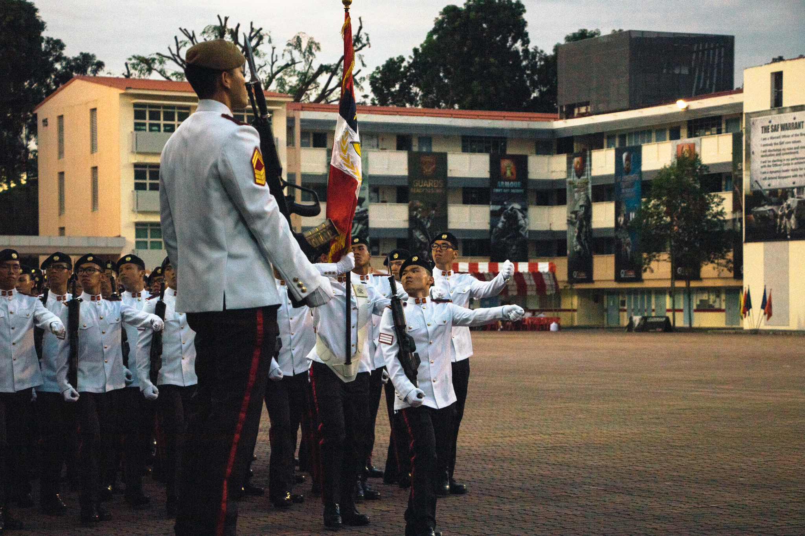

Post-parade, mom taking a shot of me in my formal uniform aka "Number 1"

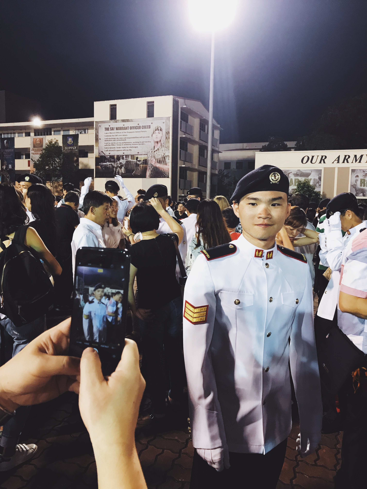

With my family as well as the commanders that took charge of me when I first entered the service in boot camp!

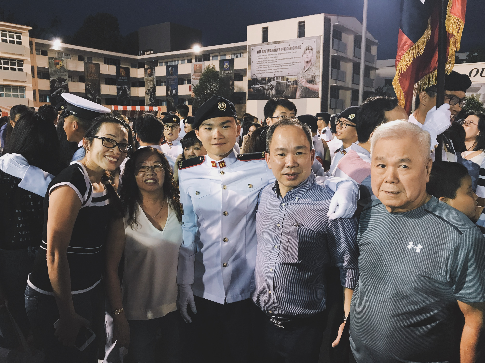
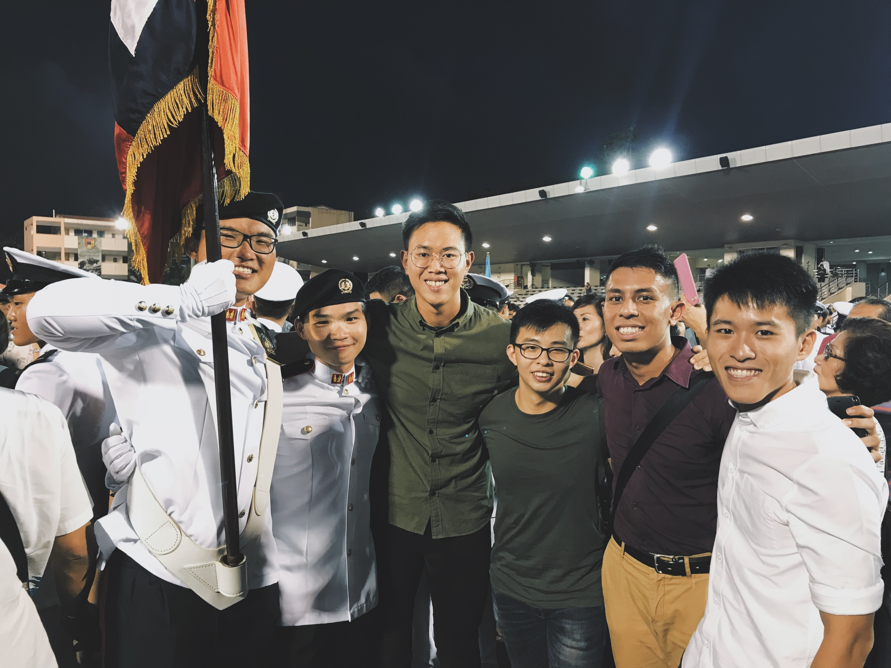

Buddy from Foundation Term, my Professional Term bunk-mates, funniest friend from boot camp, and section-mates from Foundation Term

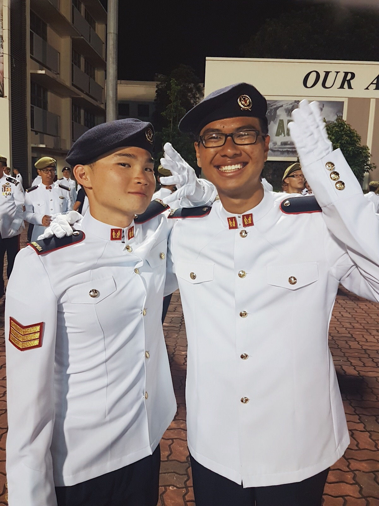
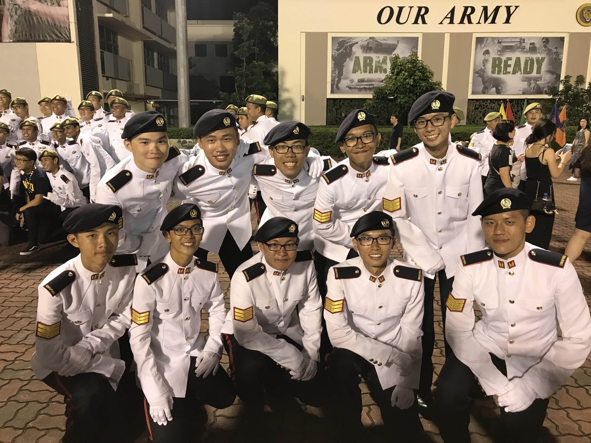
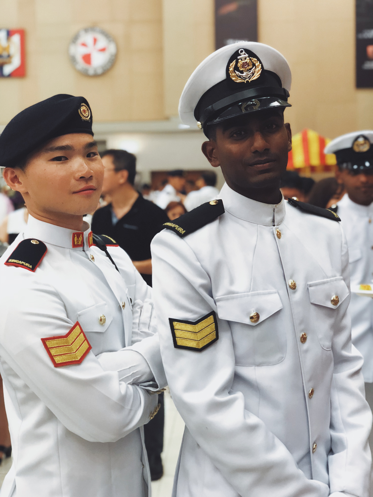
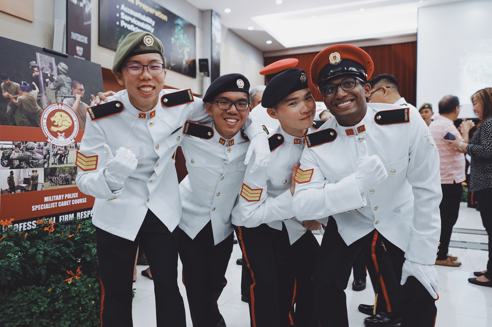

What a journey this has been. Congratulations to all my fellow graduants!
