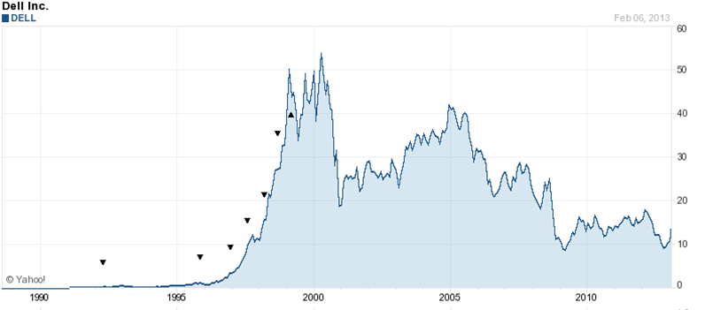
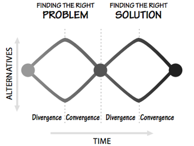
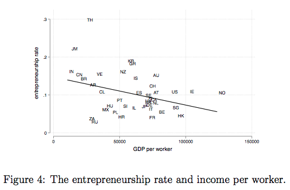

In the 1990s, Dell Computer hit its stride and quickly rose to become the one of the most successful and profitable computer companies in the world. 

However, in an attempt to continually improve efficiency metrics and financial ratios, the company implemented a strategy to outsource a large slice of their operations to a Taiwanese company, Asus. In the short term, this allowed Dell’s profitability to skyrocket and analysts rewarded the company in the markets accordingly. 

Outsourcing made Dell’s balance sheet look good, but only in expense of their innovative prowess. The success of their efforts became evident, and that led to even more outsourcing — effectively putting Asus into the business of creating its own brand of computers, and made them more competitive than Dell herself.

## What Efficiency Leaves Out
Modern design thinking teaches divergent exploration, to emphasise an equal part importance in problem discovery and definition with solution discovery and solution.

System owners however, in the name of efficiency, want to fix everything quick. This results in a disconnect between efficiency and effectiveness: creating a tendency to pour tremendous energy into doing things, with little reflection on whether those were the right things to do in the first place.

They want to fix infrastructure, financial markets, birth rates, entrepreneurship rates, and so on. Combined with an impatience because of an upcoming election or performance review, they jump straight into implementing “corrections” to smooth out the world’s jaggedness; stifling divergent exploration and interactions between entities that make it necessary for any type of innovation to even take root.

Dell’s story alone is a cautionary tale against total efficiency. Their success on paper bred a culture where maintaining the status quo became the way the excel. Where they valued efficiency, they sold out on the very thing that made them successful in the first place: the willingness to be scrappy and tinker.

## Efficiency Leading To Unsustainable Outcomes Elsewhere
In a [study](https://econpapers.repec.org/article/rjebellje/v_3a9_3ay_3a1978_3ai_3aautumn_3ap_3a508-523.htm) conducted by Robert Lucas in 1978, he predicted trends where the incentives for productivity increases will lead towards wage increases; resulting in would-be entrepreneurs being push from startups into big companies. The inverted relationship between GDP and entrepreneurship was then made evident by [Poshke(PDF)](http://markus-poschke.research.mcgill.ca/papers/mposchke_skillbias.pdf) in 2017 with data drawn from firms in more than 40 countries:

Bertrand Russell lamented that where there was formerly a capacity for lightheartedness and play, modernity brought about a cult of efficiency that washed over and demolished the pillars of satisfaction that hold up our lives. Written in 1932, it shows modernity is a natural side-effect, not a symptom confined to our generation. To be deprived of leisure is to live a life thinking everything ought to be done for the sake of something else, never for its own sake.

## Innovation Requires Creativity; Creativity Requires Leisure
Leisure is a sign that wealth is being welcomed into a system that affords a population to explore ways in solving bigger, more interesting problems for the world. While leisure will be paved by destruction and its effects gradual and incremental, system owners should focus on the cultivation of an environment that allows small mistakes from a population to improve it in a more sustainable way.

Let’s be honest: it is unrealistic for the average person to hang out in the wilderness to learn more about animals, nor for an average user of technology to assemble their own operating system. However, bringing real breakthrough innovations to bear requires having the skin in the game equivalent to being willing to do those things.

It’s time we stop telling our young people to graduate early, shepherding them down a mindless path devoid of the imagination that is required to bring greater discoveries to our world. If Galileo wasn’t allowed to spend his free time roaming around cathedrals of the University of Pisa while daydreaming in the pews, noticing the swaying of the altar lamps, modern time-keeping will not have been invented.
