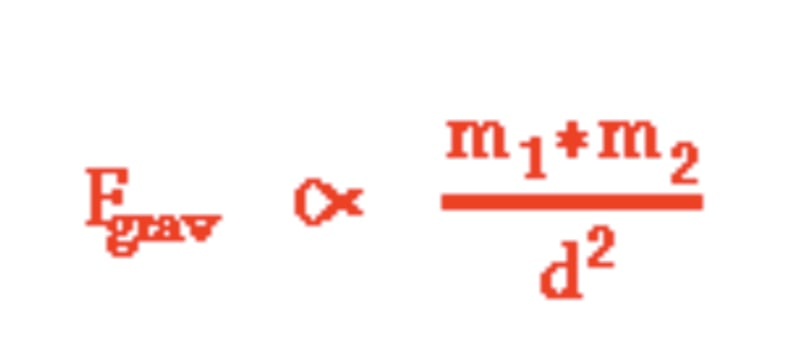
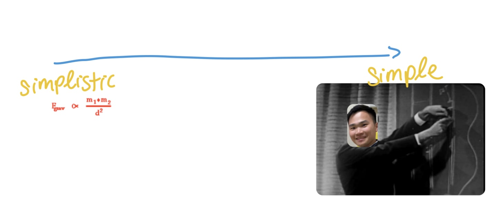
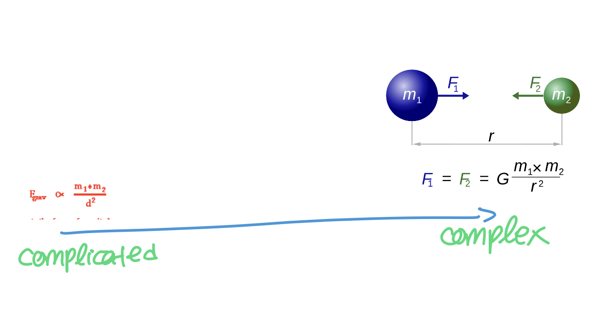
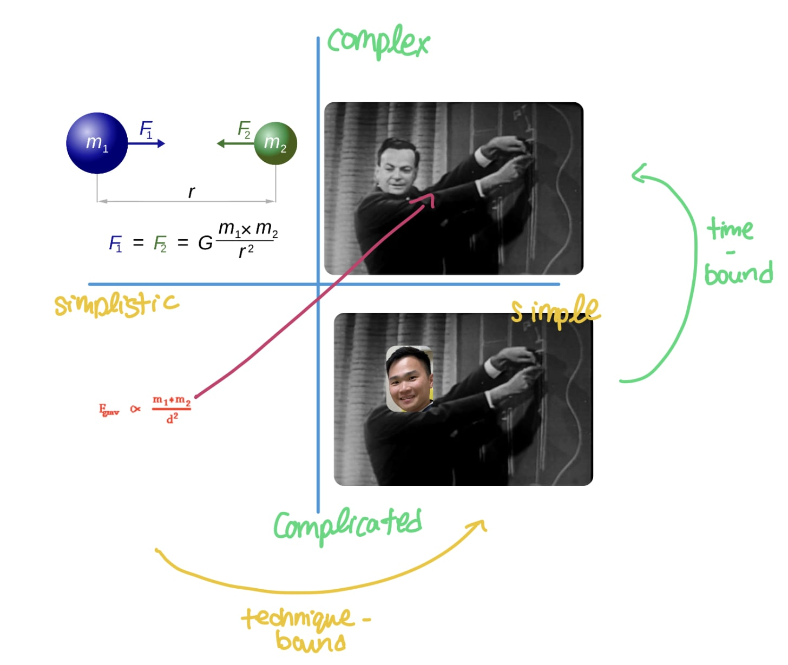

Foreword: Inspired by [Devon Zuegel](https://devonzuegel.com/post/epistemic-statuses-are-lazy-and-that-is-a-good-thing), who writes a wonderful blog, I will be incorporating the idea of explicitly declaring “epistemological status” at the top of all my posts on this blog going forward.

_Epistemic status: high by virtue of observation of most perennial works in work, art, and life_
_Epistemic effort: low. I developed these ideas as I was writing my newsletter where I try to explore as many ideas week-to-week_

---

To determine what our time is worth spending on, we spend all our lives judging quality. Clothing, furniture, the new calendar app, or even a romantic prospect at a date.

Recently on the Invest Like The Best  [podcast](http://investorfieldguide.com/tan/) , Vaughn Tan (no we're not related) shared that the quality of any given thing can be measured on two planes: complex/complicated, and simple/simplistic. 

##  Simple/Simplistic
Say today you are curious about the laws of gravitation, a quick Google lands you the following on  [physicsclassroom.com](http://physicsclassroom.com/):

With a bit of effort around what I already know about algebra and what I can guess from the formula above, I can already teach you this stuff! (quality not guaranteed)

To distinguish being simplistic from simplicity: the former respects brevity over clarity, whereas the latter respects the inverse. Traversing between this axis is purely bounded by technique.

## Complicated/Complex

Or, without speech and instruction as a medium, the equation can /also/ be better represented with graphics mapping “mass” and “force” to a diagram you can relate to.

This means…:
1. I now need to learn photoshop
2. I now need to know what “mass” /actually/ means. 

Distinguishing what is complicated from complex: complicated can be “good enough”, but by virtue of knowing what it will take to make something higher quality + and doing it, makes it “complex”. This operation is often time-bounded; where experience in life and a diversified set of skills provide disproportional amount of leverage.

Now, let’s bring them all together.

## Presenting: The Simplistic-Simple/Complicated-Complex Quadrant

Of course, there is nothing in the diagram that can beat a Richard Feynman lecture on the laws of gravity. With years of research, teaching, and impeccable drawing skills on a chalkboard, he is able to traverse both axes and deliver an unparalleled lecture.

It really makes you think: the north star of building products then really is about traversing not just a refinement of thought, but also action. An individual that possess the right duality of tasteful thought guided by an urgency and desire of getting things done and learning from trial-and-error, is sure to be able to achieve a level of quality that eventually becomes distinguishable.

Like a masterful chef, a seasoned woodworker, or an experienced software engineer, it takes years to develop a certain level of /taste/ that needs to be actively sought. 

Much of the work then trends towards abstraction, the reduction of parts, just like evolution. As described by Williston, a pioneering 19th-century paleontologist  [wrote](https://archive.org/details/waterreptilesofp00will/page/172/mode/2up)  about the evolution of water reptiles:

> The course of evolution has been to reduce the number of parts and to adapt those which remain more closely with their special uses, either by increase in size or by modifications of their shape and structure

Just like how Richard Feynman could teach Physics with simple language without dumbing down the topics, a fundamental understanding of something helps us know how to get from A to B in the shortest way.
