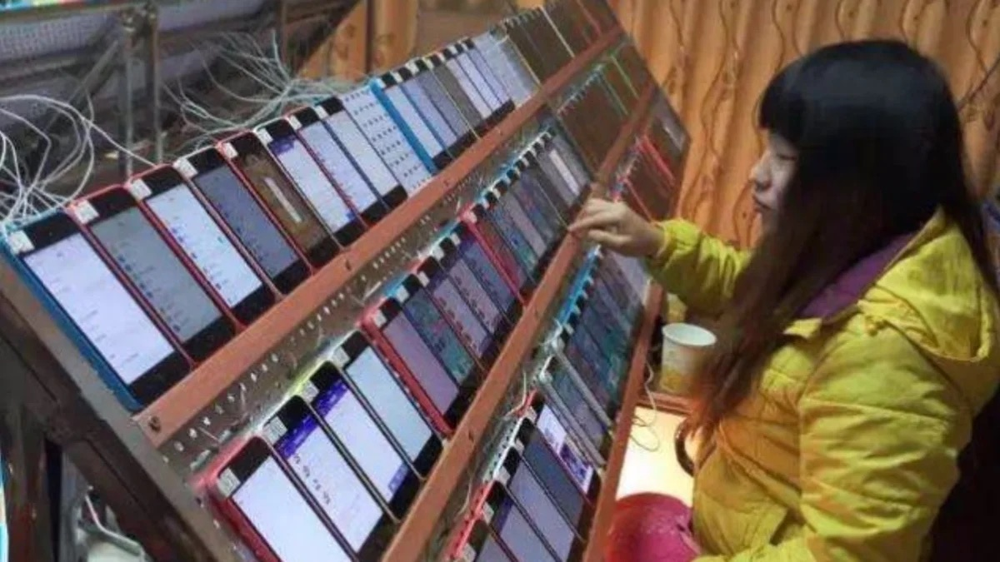

My first serious tech job was at [UserTesting](https://www.usertesting.com/). In 2016, when I started a year-long internship there, I was asked to pick a team to join. I was spoilt for choice — I could have joined literally any technical team I wanted.

What were my choices? At the time, I was already reasonably good with iOS development. I was starting to get good at web development (which was important; every software product seemed to have a web component to it). I could have picked the iOS team, in order to compound my knowledge there, or I could have done a stint on the web team, since I was still relatively inexperienced with server-side programming. 

Instead, I picked QA.

I had asked a bunch of friends for advice. My friend  [@cheeaun](https://cheeaun.com/)  suggested I join the QA team.

“The QA team?!”, I thought. This was an unsexy role. I imagined an over-glorified device farmworker spending 40 hours a week hunched over an Android phone, trying to get builds to break. At the time, I was relatively unfamiliar with the structure of a typical software engineering organization. Boy, I had a lot to learn.

Chee Aun’s reasoning was that QA teaches you all the soft skills you needed to succeed in software engineering. Many engineers didn’t have those skills earlier in their career. And by virtue of QA being unsexy, the majority of interns missed out on the lessons it had to offer. 

And Chee Aun turned out to be right. 

I discovered that 20% of QA work was about breaking stuff, but 80% of it was about working with others. While I was part of the QA team, I built tools that surfaced the right amount of information for engineers when crash reports appeared on our Trello boards. I had to learn how to switch between my QA and engineering hats to do this well. 

I also learnt that the ability to communicate a bug report that is both informative to the engineer and comprehensible for a product manager is more work than it sounds. And finally, I had to come up with creative ways to surface bug occurrence frequency from the customer support team, in order to help product teams prioritize better.

There is a school of thought out there that QA teams are unnecessary if you have good software engineering. But I think that school is flat-out wrong. There is nothing quite like the reassurance of a dedicated team focused on quality. The QA team is about more than just “breaking stuff” and giving engineers grief. It is — more importantly — about building cross-functional bridges within an organization, in the pursuit of delivering a high-quality end user experience. 

At UserTesting, QA became the entrypoint to the rest of the engineering organization. Whenever an employee encountered a bug or had some trouble figuring out how to do something with the app, they would first reach out to a QA engineer. It was almost guaranteed that QA would know the answer.

This was really only possible when QA is embedded in the product and engineering process.

QA forced me to be resourceful in working out all the possible paths through an app,  helped me forge good relationships with possibly every facet of the product organization, and lastly, it taught me to always communicate clearly. 
If you are a software engineer, at the start of your career, and you aren’t sure which technical team to pick, do QA. It is the most underrated role in any engineering organization. And if done right, under good mentorship, it can be the most foundational professional role in your career.

--

_Special Thanks: [Chee Aun](https://twitter.com/cheeaun) for giving me the advice that made this piece possible, [Cedric](https://commoncog.com/blog/) for his mentorship and helping me edit this piece, and [James van Doren](https://www.linkedin.com/in/jamesvandoren/) for being an excellent supervisor and role model during my time at UserTesting._
