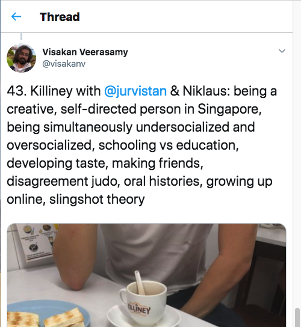

Yesterday, I met with Visakan to discuss a whole variety of topics. It all started with a question I sent on Twitter to him: what holds Singapore back and where does a country who generally gets praised for nearly everything go from here?

On Twitter, we went back and forth on uninspired populations, discussed national identity, trauma caused by WW2, LKY’s naughty boy DNA, and how we can condition ourselves to have more engaging discourse around more social issues.

Then I guess, somewhat conveniently, we decided to meet in “meatspace”!

We shared our stories, and I realised that I was not alone in feeling isolated as a young, empowered, and energetic Singaporean who did not always fit within the “mould” the government designs and shapes it policies around for.

It brought us to topics on education: have we done too much in the name of efficiency and yet too little for serendipity? Visakan has his own spin to it, and he presented it around two terms: “under-socialisation” and “over-socialisation”. To be over-socialised is to inherit too much of the status quo from existing mental models, and to quickly keep to what has known to work. To be under-socialised is to not have been given enough room to find your “schtick” through experimentation and playful curiosity.

These two phenomenons may sound mutually exclusive, but is not always true. One can be simultaneously unsure of how to put their own identity and creativity into their work (under-socialised) and as a result choose to stick with pathways and known courses of actions that someone else has told them about (over-socialised).

### My biggest takeaways

1. To cultivate an inspired population, we need to encourage people to socialise more in a playful way — cut out the KPIs, overly engineered goals/metrics — and just let magic happen. Got something you want to try? Do it. Play in traffic. Show up.

2. Then write about it. Writing is a great instrument for getting socialised; constantly reflecting on the information that is fed to our brains is a great way to reconcile them with our own identity and use it in our work

3. To extract more value from your writing and insights to the things you have learned, put it out there and share it with the world. Be okay with the fact that your perspectives can be incomplete and there will be people who will disagree with you.

4. When caught in a heated argument with someone holding incompatible opinions, remember that intellectual pursuits are not zero-sum and winning is nonsense. Arguments are an opportunity for people to convince each other that their perspectives have place in the world. When viewed from that perspective, you are more likely to form a more complete view on an issue — and if it requires decision on an action to be made, a compromise becomes an outcome worth negotiating for.

5. Use momentum from external sources of energy in your environment to propel yourself towards your desired goals. Sometimes that means looking for opportunities in the places you least expect it. That’s when it makes sense to go the long way around; just make sure you’re having fun while you’re at it. Visakan calls this [“slingshot theory”](https://twitter.com/visakanv/status/1124575393590071296).
