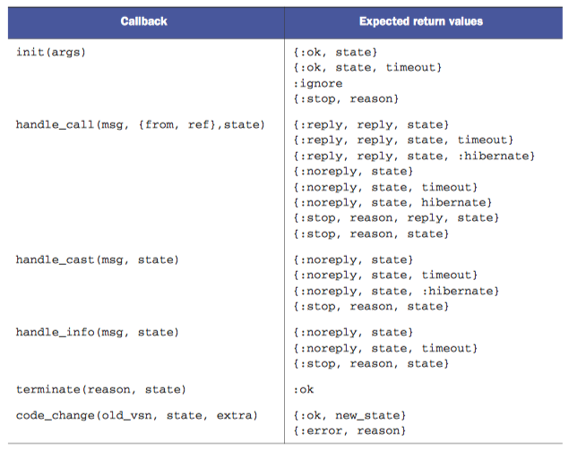
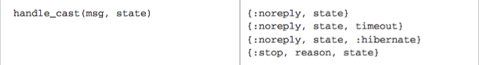
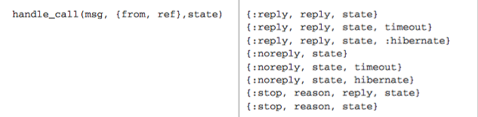

## Introduction
In this post, we dive right into learning how processes in Elixir work, what is GenServer, and the patterns that govern each GenServer application. 

The content below assumes you have reasonable knowledge around basic Elixir language features.

## What is OTP and GenServer
To perform concurrent tasks, the BEAM virtual machine used by Erlang/Elixir uses lightweight and isolated processes.

Using this design affords the following advantages:
1. Applications can serve one request without blocking another one.
2. When one process crashes, the others can keep running.

To take advantage of them, most people use OTP (Open Telecommunications Platform) — a general-purpose framework to build concurrent systems.  

OTP defines  what a structure of application and provides a database alongside useful tools for creating processes, recover from errors, logging, etc. 

_GenServer_ is the server behaviour piece provided by OTP.

## GenServer API Design
To demonstrate the standard structure of a worker built with GenServer, we’ll be progressively make one that keeps track of a simple shopping list. 

Want to see the final code source? [Click Me](https://gist.github.com/jurvis/0c5e957e22fbb98f8f68fd5ba776a4ee)

Here is what a basic structure of a GenServer worker will look like
```elixir
defmodule GenServerExample.ShoppingList do
	use GenServer
	# Client Functions

	# Server Callbacks

	# Helper Functions
end
```
**Client Functions** — you can treat these functions as the “public” access points for this worker. In this post, we will build the following features:`add`, `remove`, `print`

**Server Callbacks** — these functions represent the “server logic” that will make the stateful calls and keep track of a worker’s given state (if any)

**Helper Functions** — these series of functions will provide any convenient features to help your client and server functions stay concise.

## Initialising the Worker
To start, let’s add an initialiser to our worker:
```elixir
defmodule GenServerExample.ShoppingList do
	use GenServer
	# Client Functions
	def start_link(opts \\ []) do
		GenServer.start_link(__MODULE__, :ok, opts)
	end
	# Server Callbacks
	def init(:ok) do
		%{:ok, %{}}
	end
	# Helper Functions
end
```
`GenServer.start_link/3` defines a set of behaviours that has to happen when your worker is initialised. 

The first argument takes in the module where the `init/1` callback is define, second argument passes arguments to the callback `init/1`, and the last argument provides a set of options to register the process with the Erlang VM.  The options are out of the scope of this article, so we will just leave them empty for now.

Because GenServer enforces a lot of structure in the way we interact with the APIs, their callbacks also have expected return values. You can refer to the table below for them:



This table is important when it comes to building workers with GenServer. I find myself referring to them all the time. As we progress further down this post, I will explain the utility of each callback inside this table.

## Handling Asynchronous Calls with GenServer
Once we are done writing an initialiser for our worker, it’s time to give it some functionality. In this section, we will look at how we can add and remove items from our shopping list.

Our goal is to produce a set of APIs that will look something like this:
```elixir
iex(2)> GenServerExample.ShoppingList.add(pid, "Eggs")
:ok
iex(3)> GenServerExample.ShoppingList.remove(pid, "Eggs")
:ok
```

Add the following functions inside the “Client Functions” section:
```elixir
def add(pid, {:add, name}) do
	GenServer.cast(pid, {:add, name})
end

def remove(pid, {:remove, name}) do
	GenServer.cast(pid, {:remove, name})
end
```
As you can observe, both functions take in similar arguments — the first one being the parent process’ ID, and the second one being information to be passed to our server callbacks. Let’s define them now. 

Under the `ShoppingList.init` function, add the following functions:
```elixir
def handle_cast({:add, name}, shopping_list) do
	new_shopping_list = [name | shopping_list] # append item to exisitng list
	{:noreply, new_shopping_list} 
end

def handle_cast({:remove, name}, shopping_list) do
	new_shopping_list = List.delete(shopping_list, name) # delete item from list
	{:noreply, new_shopping_list} 
end
```
Let’s parse through what’s going on here. The client functions we have added, `add/2` and `remove/2`, call `GenServer.cast/2`. 

GenServer then subsequently pattern matches the value of the second argument of the `GenServer.cast/2` function to find the corresponding `handle_cast/2` callback. 

Within each `handle_cast/2` callback, a new state is constructed using our List append/delete function, and returns a tuple that conforms to the expected return values.



In this scenario, `handle_cast/2`  returns a 2 element tuple, re-defining the internal state of our worker using the second element.

Let’s run the worker in our REPL now and see it in action:
```elixir 
> iex -S mix
iex(1)> {:ok, pid} = GenServerExample.ShoppingList.start_link
{:ok, #PID<0.134.0>}
iex(2)> GenServerExample.ShoppingList.add(pid, "Eggs")
:ok
iex(3)> GenServerExample.ShoppingList.remove(pid, "Eggs")
:ok
```
Great! Now let’s figure out a way to print out our shopping list to see if it _actually_ works. To do this, we need to use synchronous calls.

## Handling Synchronous Calls with GenServer
In the last section, we used asynchronous calls to add objects into our ShoppingList worker. In this section we will look at how we can write the synchronous function `print/2` so we can see our shopping list.

When deciding whether or not to use a asynchronous or synchronous call, we revolve it around a single principle: **if you expect a reply from the server, use a synchronous function, else use an asynchronous one.**

Because `print` will expect some type of response from the server, it will be written as a synchronous function.

Under the remove function, add the following client function to our worker:
```elixir
def print(pid) do
	GenServer.call(pid, :print)
end
```
and the following callback function under the `init/1` function:
```elixir
def handle_call(:print, _from, shopping_list) do
	{:reply, shopping_list, shopping_list}
end
```
As you can see, the patterns remain fairly similar to those used for asynchronous functions. We pattern match the symbol passed as a second argument in our client API `print/1`, that calls the `handle_call(:print, _from, shopping_list` callback. 



Referring again to our table above, we use the `{:reply, reply, state}` tuple to exit out of the callback. `Reply` represents the value to be returned to the caller of the function, while `state` is what you will define if modifying the internal state of the worker.

Let’s run the worker in our REPL now and see it in action:
```elixir 
> iex -S mix
iex(1)> {:ok, pid} = GenServerExample.ShoppingList.start_link
{:ok, #PID<0.134.0>}
iex(2)> GenServerExample.ShoppingList.add(pid, "Eggs")
:ok
iex(3)> GenServerExample.ShoppingList.add(pid, "Bread")
:ok
iex(4)> GenServerExample.ShoppingList.print(pid)
["Bread", "Eggs"]
iex(5)> GenServerExample.ShoppingList.remove(pid, "Bread")
:ok
iex(6)> GenServerExample.ShoppingList.print(pid)
["Eggs"]
```

Voila! You have built your very first basic GenServer application!

## Conclusion
In this post, we covered:
* What is GenServer and OTP
* Why OTP is designed for developers to strive for a consistent structure in code for GenServer applications.
* When to use `GenServer.call/3` and `GenServer.cast/2` 
* How OTP takes care of asynchronous and synchronous behaviours automatically; abstracting away the complexity of handling the calls manually.

### Want to learn more? 
* Read the GenServer guide on the Elixir website: [GenServer - Elixir](https://elixir-lang.org/getting-started/mix-otp/genserver.html)
* Code from this post: [Simple GenServer Application · GitHub](https://gist.github.com/jurvis/0c5e957e22fbb98f8f68fd5ba776a4ee)
* Credits to [Benjamin](https://twitter.com/bentanweihao) for the excellent table listing `GenServer` callbacks and their expected return values.