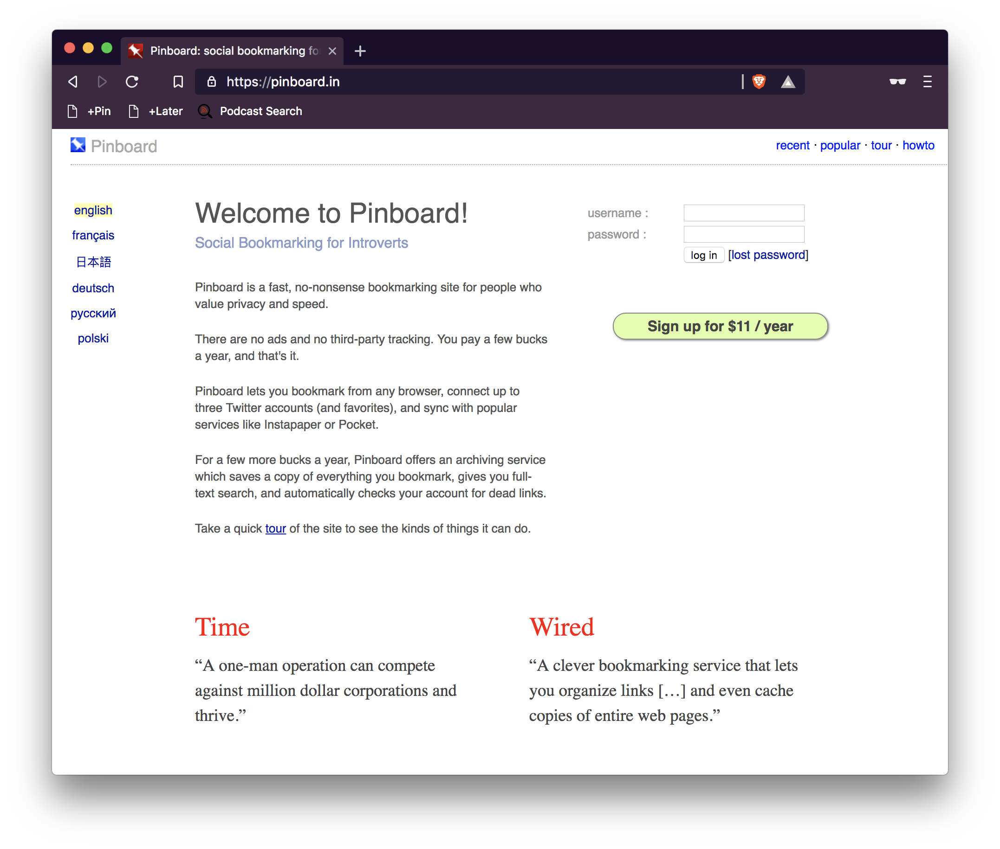
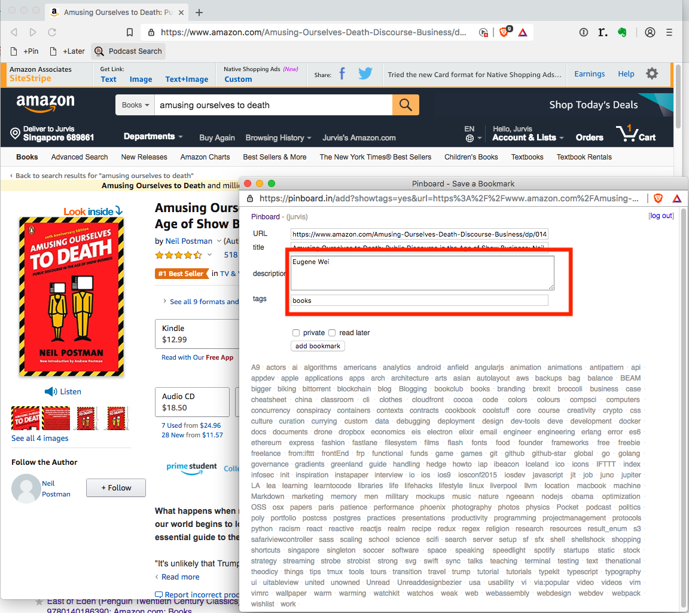
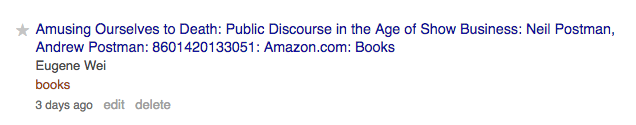
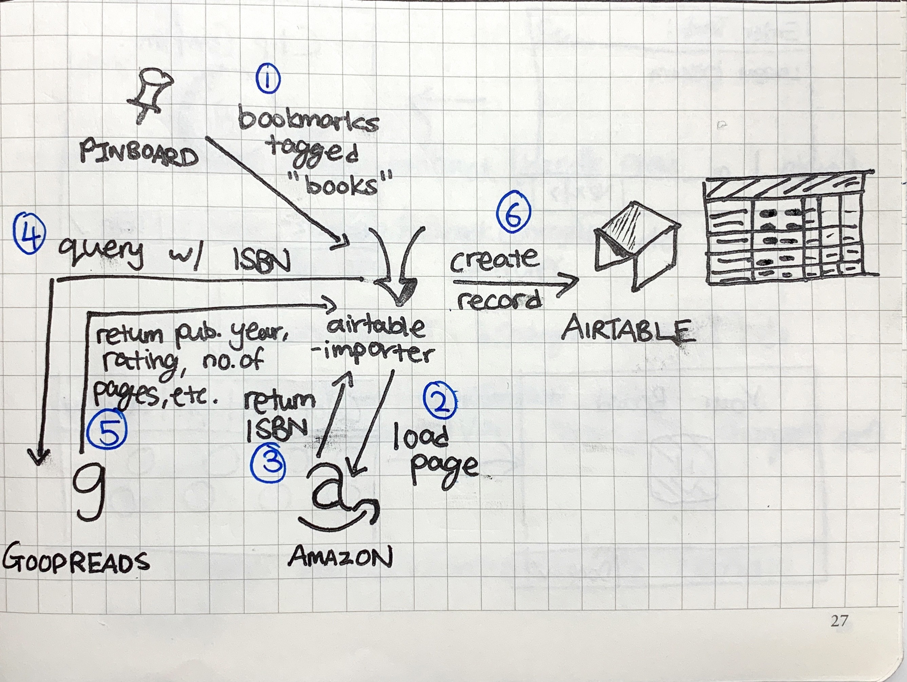
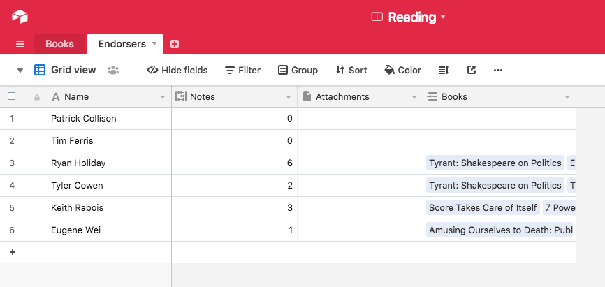

After reading this magnificent [post](http://sirupsen.com/read/) by Simon, I was inspired to come up with a new way of processing information when I read my books. You can read more about that [here](https://jurv.is/posts/jurvis-information-processor-2019).

In this post however, I will take everyone through a step-by-step workflow of how I keep track of the books I want to read. 

## Introducing Pinboard
Let’s start by introducing Pinboard, my choice bookmarking service. Pinboard is an ad-free, tracking-free, and no-frills online bookmarking service. I love it for the very fact it is independent and does it job so fantastically well while requiring no fanfare at all. (it also has a great API!)

Now that we know what Pinboard is, here is what happens when I find/hear about something interesting online

## Discovering the Book
While I was listening to Eugene Wei’s interview on the podcast “Invest Like The Best”, he highly recommended a book titled “Amusing Ourselves To Death” by Neil Postman. It sounds really interesting so I decide to check it out.

I fire up Amazon, bring up the listing of the book, and decide that some day I will like to read this. I now fire up the Pinboard bookmarklet that allows me to define other optional properties for this listing

Under description, I will input the person who recommended this book (in this case, “Eugene Wei”), and add the tag “books” to it. The description box also support comma-delimited recommenders, so this example will be completely valid too: “Person A, Person B”

## airtable-importer
I wrote a little [collection](https://github.com/jurvis/airtable-importer) of Rake tasks that then takes care of hitting the Pinboard API, requesting for books tagged “books”, and use it to scrape data off Goodreads/Amazon. They include: ISBN, Categories, Goodreads Rating, Publication Year, Number of Pages, and Number of Ratings.

The re-population is done every 12 hours. The diagram below shows step-by-step what the scripts do.

## Result on AirTable
Once all records are successfully process, they show up on AirTable with all the necessary requested content as a single record.

The coolest bit is also seeing and keeping track whom might have had an influence in helping a book get on the list! 

## Conclusion
This system of keeping track of books and selecting the next one to read has been fantastic because it surfaces a lot of relevant metadata to help me make decisions. 

For example, if I am feeling a new non-fiction book and will love to sink my teeth in to something that people consider perennial, I will respect the Lindy Effect and look for the oldest book and the one with the highest Goodreads Rating. While this heuristic of deciding what to read is not at all scientific, I find it rather satisfactory for now. 

If anyone has interesting ideas to share, please send me a DM: [https://twitter.com/jurvistan/](https://twitter.com/jurvistan).
