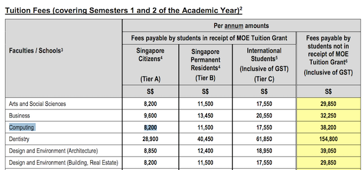

In his book The Real Enemy, Pierre D’Harcourt recounts a story of an eminent scientist during his time in Buchenwald. Fearful of being stricken by a cold at 5AM when roll call is taken, the scientist knew fully well that if he slept too close to the fire in the hut, the tendency will ultimately be to sleep closer and closer to it. Yet despite his intellectual awareness, he eventually gave way and slept closer and closer to the comfort of this fire. Eventually, he contracted pneumonia — as he knew and feared — and died.

Life has immeasurable ways outside of intellect in determining our potential. In the scientist’s case, there was nothing wrong with his intellect; but the motivators that modulated his personality eventually betrayed him.

Tuition in Singapore costs $6000 a year as a citizen. Which amounts to $24,000 for a Bachelor’s degree.

As responsible savers, my parents have always been my source of comfort: over the years, they saved up enough to help me pay for college. If I stay, I will never have to worry about feeding myself, nor will I need to worry about rent because I will still [live with them](https://twitter.com/visakanv/status/1139391168590954498) . Super comfortable.

To give some perspective, that same $24,000 will only pay for 2 years of my tuition in Santa Monica College (excluding rent, living expenses, etc.).

## Sleeping Away From The Fire

I have always had a bit of a taste for risk than I am willing to admit:
* When I was 12, I convinced my parents to enrol me into the pioneering batch of a new [ secondary school](https://web.archive.org/web/20080409112507/https://www.moe.gov.sg/media/press/2008/03/new-school-of-science-and-tech.php) , all on the basis of believing in the experiment that a self-directed and applied approach to learning will work on me. And the school had no way of proving that with any “track record” whatsoever. I was put under pressure to perform academically, to say the least. But I never complained: I chose my own adventure!
* After leaving secondary school, I had to make the choice between two distinct paths in my education: one that focuses on vocational training over academics, and another that delivers a more traditional English/Math/Sciences/Economics education. I knew the former was more suitable for my style of learning of practice over theory, despite its stigma as both a route for “weaker” students and tougher advance to tertiary education. I picked it, and went all-in anyway.

What do all those things have in common? I was pretty much _super uncomfortable_ making *all* of those bets. However, the discomfort ultimately became worth its while, and the good things I enjoy in my life today cannot have existed without them.

> Make mistakes of ambition and not mistakes of sloth — Niccolo Machiavelli.

Without my bet to enrol in that new and unproven secondary school, I will never have discovered my love for building products and software engineering. Without that discovery, I will not have made the bet to pick a vocational and skills-oriented education where the incentive to do well aligns with learning practical skills. If not for my exposure to learning those practical skills, I will not have landed my “big break” job when I was 16, nor be ready for the opportunity to work in San Francisco when it presented itself.

## And For My Next Bet…
The stakes are high: enrolling in a college 8000 miles away with an astronomical bill to bear is objectively crazy. But the downsides can be minimal as long as I can make it worth it the same way I did with all my other bets.

Planning for this upcoming endeavour has started to pay its dividends: I started my own app development studio as a means of converting my skills into money, and educated myself about finance and investing to open up additional income streams while I served my conscription.

I am not claiming my personal risk to be anywhere close to the valiant act of [Cortes burning his ships](https://travisrobertson.com/leadership/burn-ships-succeed-die/), but I’d be lying if I said it wasn’t an inspiration. I am just a single story. Imagine the similar stories told across a large network of people. 

## A Metropolitan City’s Network Effect

Highly competent people like working with other highly competent people on interesting problems. Often because these interesting ideas run against the status quo of their own local communities, a network effect is created; drawing like-minded people across the world to cities like San Francisco, Los Angeles, and New York City.

Leaving a local community is never easy, much less staking some part of your personal/professional life to chase down dreams people normally raise their eyebrows at you over. Individuals go to great lengths to earn their right to be in those cities, and excelling against the dogma takes a real capacity for action.

## The Upside: A Platform To Thrive

While I always felt a little like a manic at home, I felt right at home when I went to San Francisco for the first time. I had conversations with random people at a diner and made friends with people at my hotel breakfast chatting up random ideas: it felt like magic! People _actually_ took me, a 15-year-old, seriously. This will not be possible at home.

I thrived in that environment with high information permeability: where people dream up what a better world can look like, without being afraid to sound a little crazy with their audacious visions of how they will take us there. It sounds cliché, but I truly believed that as a 15-year-old boy; and still do today.

Relentless experimentation, tinkering, and having a capacity for failure are qualities I aspire towards.  True in both school and the course of my young career, I learned best being around individuals with strong capacities for action. 

Moving to the US and being able to participate in such a community gives me the motivation that will keep me away from the comfortable fire in the hut; so I can live a life as stimulating, as meaningful, and as much of a joy as any existence on this Earth can offer a person. 

You simply cannot put a price on that.

> It is not the critic who counts; not the man who points out how the strong man stumbles, or where the doer of deeds could have done them better. The credit belongs to the man who is actually in the arena, whose face is marred by dust and sweat and blood; who strives valiantly; who errs, who comes short again and again, because there is no effort without error and shortcoming; but who does actually strive to do the deeds; who knows great enthusiasms, the great devotions; who spends himself in a worthy cause; who at the best knows in the end the triumph of high achievement, and who at the worst, if he fails, at least fails while daring greatly, so that his place shall never be with those cold and timid souls who neither know victory nor defeat.
— Theodore Roosevelt, The Man In The Arena
