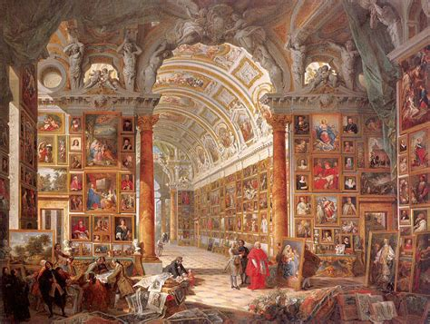
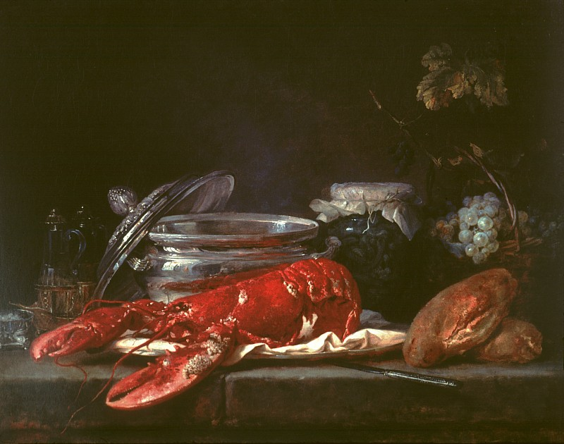
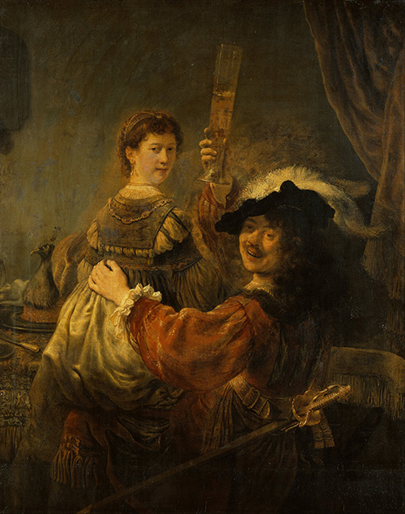
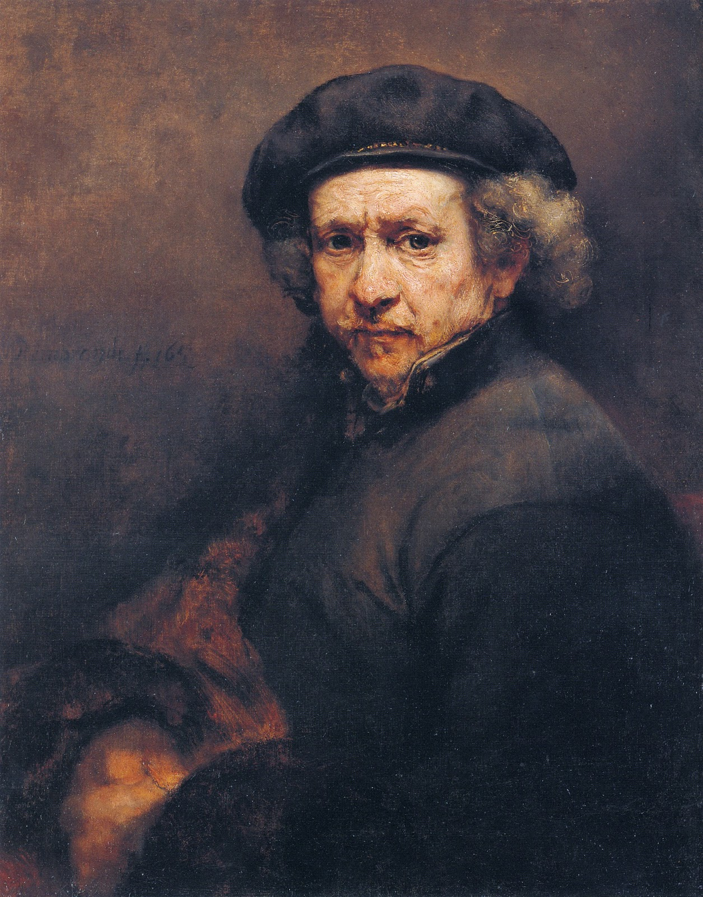

For my English class in college, we were asked to summarise a chapter from John Berger’s book _Way’s of Seeing_. The book broadly struck me as a poignant critique of our relationship with images throughout history. Using examples from nude paintings to the billboards in Times Square, the book encourages us to consider the subconscious narrative scripts that get played back to us daily in the media.

My favourite chapter of the book was when Berger articulated how the object-centricity of the European Renaissance found a way to its art and humanity’s relationship with images. Illuminating how materialism came to bear on art through a rising middle class, the chapter featured their perspective of owning a painting of a thing being the same as owning the item itself. This shift in the way of seeing art, Berger suggests, enveloped art’s traditions with cynicism and, by extension, our social fabrics. Exhibiting the way paintings evolved through this new perspective, Berger is hopeful that keen observers will be able to distinguish outstanding art from the average.

In the 16th century, European explorers set sail to the far expanses of the world. In search of fresh new opportunities for trade, they discovered new commodities from new countries, developed new bookkeeping methods, and created new markets for maximizing the production and sales of these goods. As their wealth grew, more individuals looked on with higher ambitions.

These ambitions, known today in connection with “Western capitalism,” became an aspiration for this new rising class of merchants. Focused on increasing wealth and production, Western capitalism leverages its extensive access to trading partners across the globe, enabling what Berger calls in the book, “new attitudes to property and exchange” (87). This new perspective, fuelled by the rise in wealth and capitalistic ambitions, produced a rising middle class with more significant means to acquire more material possessions.

Experiencing their newly-found social mobility, the merchants sought a way to signal their relative success in their competition amongst themselves. The competition led to an object-centric way of seeing, best described by the anthropologist Claude Levi-Strauss, who claimed that paintings began to reflect the “avid and ambitious desire to take possession of the object for the benefit of the owner or even of the spectator” (84).

While mixing oil with pigment has been a technique that has existed since ancient times, oil painting as an art form only found its place in the world through the possessive impulses of this new middle class. By depicting realism better than medieval artistic conventions, oil painting thrived for its ability to reproduce the desirability of touching an object, and by extension, the pleasure one gets from owning it. Uniquely positioned to capture capitalism, oil paintings possessed what Berger defines as a “special ability to render the tangibility, the texture, the lustre, the solidity of what it depicts.” (88)

Being able to experience this supreme power of wealth through art, Berger posits, has “conveyed a vision of total exteriority” (87). Perniciously, the value of these paintings was tied to the ability to perform a merchant’s material aspirations and possessive desires, not to express the meaning they possess. As a result, art appreciation took on a whole new meaning as well. Widely cited as an exemplary era where “art prospers if enough individuals in society have a love of art” (84), Berger argues that this new wave of “love of art” has only been matched by the amount of bad art produced.

To demonstrate this, Berger includes in the chapter a series of images depicting art galleries with paintings in them. In Panini’s _Picture Gallery of Cardinal Valenti Gonzaga_, the gallery’s walls are lined with paintings in abundance, with merchants perusing and judging them. Some are framed and displayed, but many are left lying on the floor, ready to be discarded. Like objects in a marketplace to be traded, Berger observes that these paintings represent a juncture in art history where all paintings have “became exchangeable because everything becomes a commodity.” (87)

When market forces prevailed over artistic expression, what followed was what Berger calls “hack work”; paintings that became “less meaningful to the painter than the finishing of the commission or the selling of his product” (88). The rise in mediocrity can be observed in De Heem’s _Still Life With a Lobster_, which paints exclusively edible objects meant to signal the expensive lifestyle of the painting’s owner, with complete disregard for the painter’s virtuosity.

Dissatisfied at their life’s work made only to serve at “confirm[ing] the owner’s wealth and habitual style of living.” (99) and the “material property and status that accompanied it” (110), Renaissance painters were left to struggle between the realities of making a living and staying true to their artistic values.

Any painter who weathers this long and fierce struggle, according to Berger, has a shot at elevating their work from “average” to “exceptional.” To illustrate this, he invites us to contrast two paintings by Rembrandt: _Portrait of Himself and Saskia_ and _Self-Portrait_. In _Portrait of Himself_, Rembrandt portrays himself as a younger man at his wedding, painted as per what you would expect from a painter at the time. It checked all the boxes for a piece of work that reflected its owner’s success and wealth: meticulously rendered garments, a sword drawn from its scabbard, the peacock on the dining table, and his wife, Saskia. Like other oil paintings of that time, _Portrait of Himself and Saskia_ was just as soulless, merely serving as a means for a young and successful Rembrandt to project his material aspirations and possessions on canvas, including his wife.

However, in _Self-Portrait_, all that is material is now gone. Painted near the end of his life, Rembrandt channels the meticulousness of his style and the technical advantages of oil painting into the textual rendering of his face. Almost as if presenting the imperfections and pain of life, the texture is a metaphor for Rembrandt’s questioning of his own. Having “turned the tradition against itself” (112), which deliberately excludes the subjectivity of those represented, Rembrandt has, according to Berger, regained control of the art as an expression, making it an exceptional piece of work.

Berger has shown us that art does more than sit on our walls. Citing its ability to have a profound impact on our social fabrics, he shows us why it is vital for us to distinguish exceptional works from the mediocre. Berger argues that exceptional works of art possess a virtue that mediocre ones do not: authenticity. From William Blake’s _Illustration To Dante’s Divine Comedy_ to the landscape paintings he considers exceptional, Berger hopes to demonstrate that authenticity means staying faithful to the artistic quality of one’s craft, often at the expense of tradition. In the context of oil painting, that means working against its objectifying and dehumanizing nature and prioritizing the subjectivity of the represented over the spectator-owner. When a painter manages to break free from the artistic and social constructs that bind them, only can they produce compositions that are not just exceptions to the rule, but also artistically exceptional.
