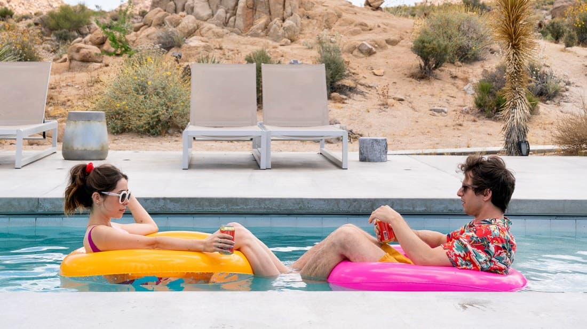
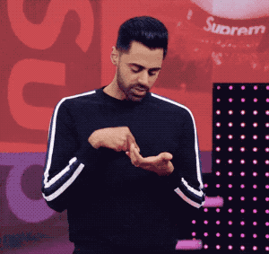
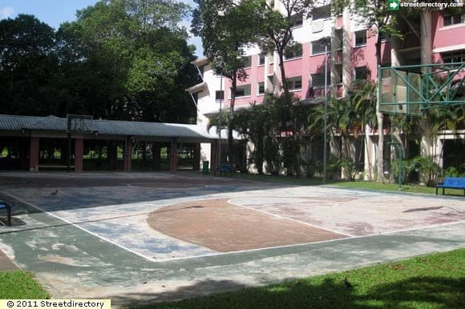

I have been thinking about time.

When the pandemic started, I was ecstatic to be free of "mindless" obligations. I even kept score. Between the time spent on my commutes and having to get ready, I would save at least two hours each day! Even my introverted self was celebrating: I would no longer feel any obligation to show up for social events for the foreseeable future. Simply because there weren't any.

I was also feeling excited, what with VCs putting out rallying calls IN ALL CAPS and article after article of opportunities for creation. Hell, I even sold the optimistic case in my newsletter.

Here's my report: I was wrong.

When Palm Springs debuted in the middle of July, it gave me a starker look at my reality. Mondays felt like Sundays, Wednesdays felt like Saturdays, and Fridays felt like tomorrow. Embarrassing moments in class and reckless drivers on the freeway have made way for, well, nothing.

I have lost track of time. I call this Pandemic Standard Time.

What used to make each day memorable or traumatizing is now gone. My new normal is sticking to a schedule in an attempt to stay productive. Instead of filling the gaps with doing what I loved, I just filled it with more obligations. I no longer had any excuse to be idle.

On weekdays, I usually start my day at 6 AM with a mise en place: I clean my desk, make coffee, prepare the readings, and brief myself for the day ahead. During Pandemic Standard Time, I find myself doing this even on the weekends. This is odd. I usually sleep in on weekends. But now, like a jogger on a runner's high, I keep going.

I am afraid of losing momentum.

I fear that the loss of routine for a single day will throw me off my "game," cause me to spiral over the week, and by Wednesday, I would find myself, resigned, on my bed, scrolling Reddit until the cows come home.

I keep thinking of Josef Pieper's 1948 book, Leisure, the Basis of Culture. The book is essentially a manifesto on reclaiming the joys of being human from a culture of work. Pieper argued that our cultivated fetish for productivity had commodified our aliveness.

This hit hard. My productivity fetishism has only intensified over the course of the pandemic. Consequently, my existence has been reduced to class discussion posts and paper submissions. I yearn to be free of this banality.

One of my fondest memories as a child was playing with my friends within my housing estate.

At 5 PM every day, I met my friends downstairs at this basketball court, and we decided what to play. There were no plans. Depending on who brought what, we played basketball, took our bikes looking for dirt trails to race down over and over until we scraped our knees, or played "catch", racing up and down the buildings' stairwells.

For that hour each day, I was free, even if temporarily, from schedules and deadlines. Today, however, I feel sorely governed by it. I miss choosing to work on my side projects on the weekend simply because I felt like it. These days, in Pandemic Standard Time, I feel so exhausted from my routines that my passions feel like a drag. In Pandemic Standard Time, signaling that you are working on something is the new "hanging out at the park."

I don't remember a weekend now where I did not hear a whisper in my head saying, "go find something to work on, you sloth."

<i>

Special thanks once again to [Cedric](https://twitter.com/ejames_c/) for working with me to edit this piece. 

Cedric runs a blog over at [CommonCog](https://commoncog.com/blog/), where he writes book summaries and career moats. 

</i>