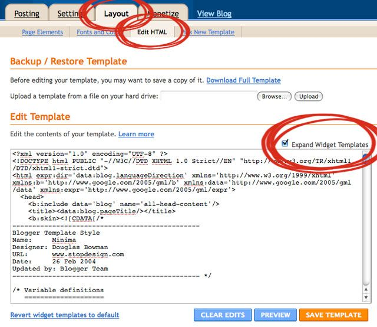
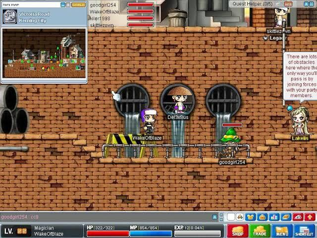
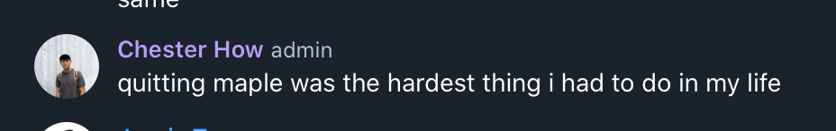
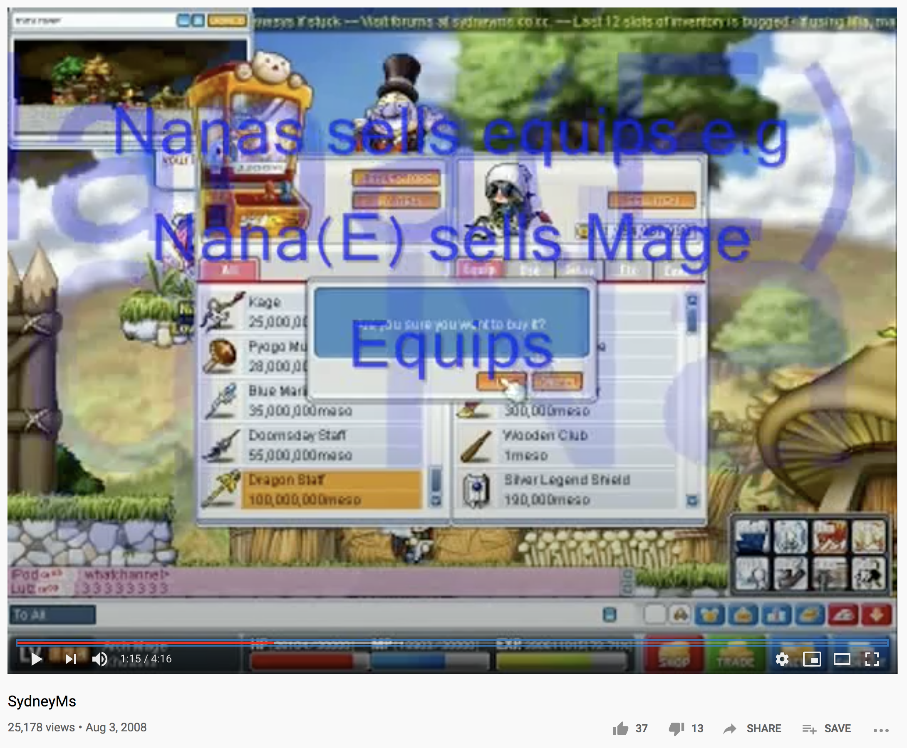
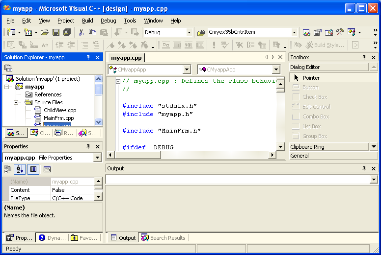

Here is the story of how I fell in love with computers. 

I did not know software engineering existed as a profession until I was thirteen. Up till then, all I wanted to be was a ‘computer expert’. I thought all ‘computer work’ was fixing drivers and getting PowerPoint slides to show up.

Little did I know, I was already a programmer. 

## My First Love: Blogger.com

A blog on Blogger.com was what every pre-teen and teenager really wanted in 2005. Everyone wanted a fancy corner of the Internet for gossip, and angsty rants. The good ones became bragging rights. I remember all the work that had to go into making cursors covered in glitter, hidden YouTube iframes that automatically played Avril Lavigne, and ‘tagboxes’, which were colorful chat boxes for your friends to say, “I was here!”

My ‘programming’ journey started right when I was trying to help my sister add a ‘tagbox’ to her Blogspot theme.

I saw the variable definitions, and they looked like algebra. I thought: “hey maybe I could use what I learnt in school here”, and I was on my way. 

I iterated on the templates and versioned them in a folder on the desktop with Notepad until they worked flawlessly. I still remember the jubilation I felt when I modified the text's color and font on her blog. 

It was fantastic.

In my eyes, I wasn't doing ‘web design’ or ‘programming’, I was helping my sister as an aspiring ‘computer expert’. And that was how I saw myself: I was that kid the class turned to when our teacher couldn't figure out why her Powerpoint slides had no sound. 

I lived for the cheers when the sound came on.

## My Choice Drug: MapleStory

When I wasn’t busy fixing other people's tech problems, I was obsessed with one particular game on my family's computer. 

That game was MapleStory. 

It had everything you'd expect from a Role-Playing Game and more: avatar customization, micro-transactions, and a sophisticated monetary system that allowed you to exchange fiat for in-game currency.

At least in Asia, the game was HUGE. It was the Fortnite of my childhood. I was very addicted. And so were my friends.

Then, I stumbled upon this video on YouTube video of someone introducing his own “forked” MapleStory world; also known as a “private server”:

https://www.youtube.com/watch?v=gfyVZ-Gwr6k 

I had a brainwave: I could learn to host my own private server, get all my friends in school to join, and become the most popular kid! As a nerd, this was huge. I was drawn to this because I found a way to get real-life status while also earning in-game cred.

I learned to write plug-ins and customizations, added them to my server, and exchanged that for favors and McDonald's from my friends. I even asked someone to help me ask my crush for her number in exchange for 150M of in-game money. 

(I was 12.)

To set up my private server, I had to follow tutorials from the RageZone forums. I built simple registration pages, hosted it off an Apache web server with XAMPP, learned how to create MySQL databases with Navicat, and ran Hamachi to tunnel public connections to the server application.

This still did not feel like programming to me. I just wanted an instance of my favourite virtual world, one that I could call my own; a place where my friends and I could let our imaginations run wild.

## The Accidental Programmer

I did not consider myself a programmer for a few more years. I continued making stuff, but it was all for fun, none of it serious.

See, I never really understood the potential of my skill until much later. I continued messing with code, creating prank scripts that made thousands of nested folders on my friends' computers, started a YouTube channel, and just had a lot of fun making videos, photos, and things.

I did not build or ship any real apps, but there was a beauty in that play. The skills I learned theming my sister's blog and running my private server became useful when I eventually got around to programming proper.

Back when I was younger, I totally wasn’t focused on being original. I just copied whatever worked. I was perfectly willing to be a sponge: I absorbed everything I read, adopted anything that interested me, and took whatever I found useful for my purposes. 

I thought only of making my sister and my friends happy.

## Playfulness in Adulthood

In the past, when you played, there was no ‘right answer.’ There were no goals. Today, however, I think about a lot more when I am programming. 

I think about what skills I need to learn for my internships, about what sort of programmer I want to be, and what kind of career I want to have after I graduate. I like building apps and tools, but do I want to be an iOS developer or backend developer? Explore my interest in blockchain development? Or try to break into production engineering?

Do I have to choose?

Many will look at this and suggest the ‘generalist’ approach, but I think that strategy is misguided. What is the use of having the most accurate model of engineering approaches to problems, when you fail to create depth necessary to make an outsized impact on a problem?

Full playfulness and freeform under these conditions feel almost impossible. 

## More Questions Than Answers

I look back to the lost playfulness of my youth with some longing. But also know that it is not possible to be that kid again.

I used to think that growing up meant having more of my questions answered. Now I only wonder if it is possible to balance the playfulness of my youth against the practical cares of adulthood. 

I suspect I will be spending the rest of my life chasing that balance.
