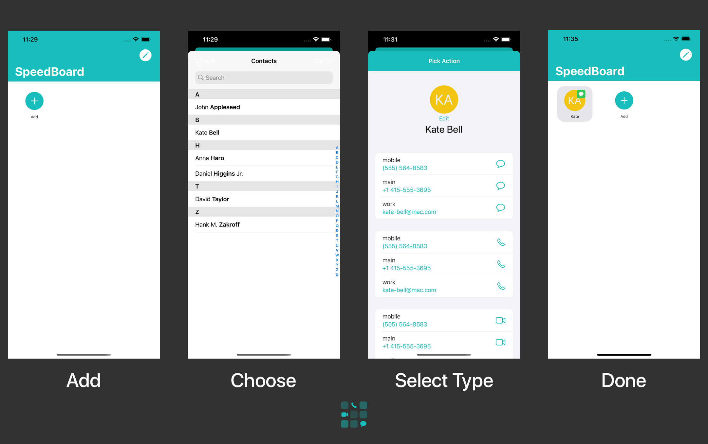
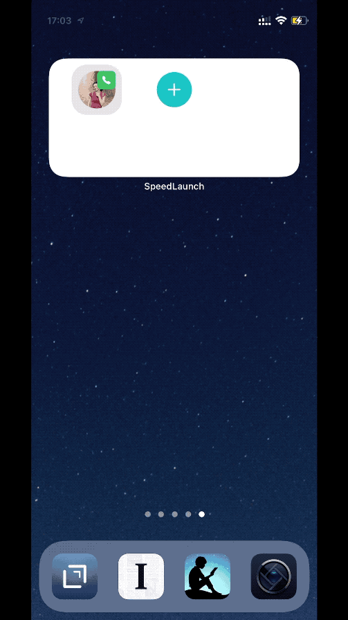

Today, I'm announcing the release of SpeedBoard, a speed dial app made for everyone.

SpeedBoard makes it easy for you to configure calling/texting shortcuts for your iPhone and put them on your home screen with iOS 14.

Configuring actions only takes four steps:

So you can call your loved ones like this:

I will be honest. Most you of will not find this app useful. 

I made this after years of watching my grandparents struggle with adapting to smartphones. My hope is to be able to create a simple tool for them to access their phone's most basic features. I write more about the product-building process [here](/posts/2020/11/speedboard-origins).

If you will like to download SpeedBoard, it is also now available on the [App Store](https://apps.apple.com/us/app/speedboard-speed-dial-app/id1529980584). 

For those of you curious about how I built it, the code is also available on [GitHub](https://github.com/undertideco/speedboard). Do excuse the mess; I haven't had time to clean it up or write a README!
