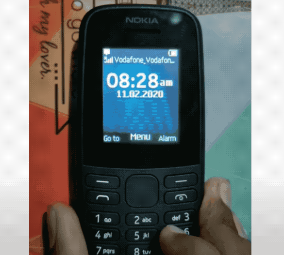
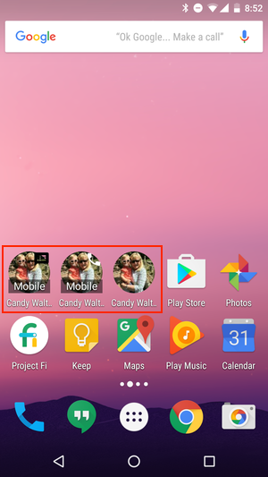
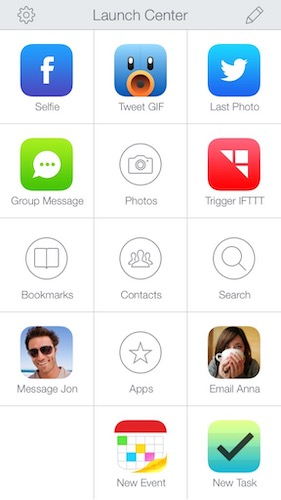
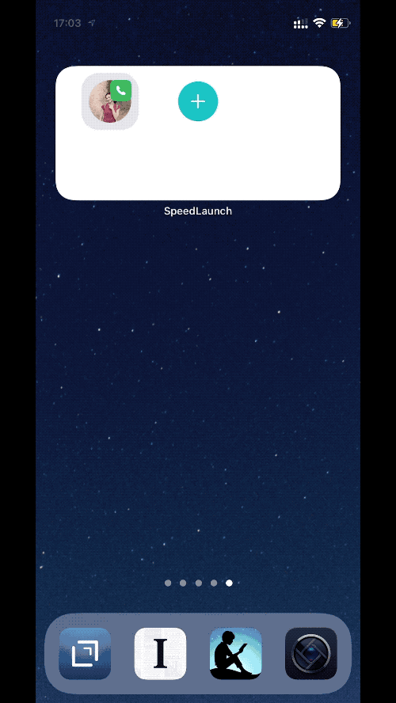
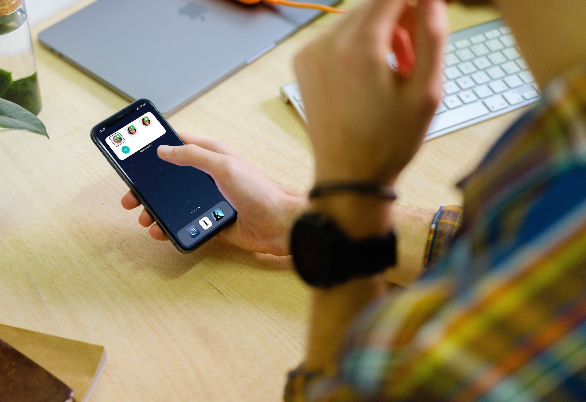

When we gave my grandparents their first smartphones, they had a lot of trouble using it. Feature phones were simple. They came with hardware-based buttons and represented 90% of what my grandparents used their phone for: calling.

This was intuitive especially for my grandmother, who is illiterate. Words on-screen mean nothing to her. 
Switching to a smartphone was challenging. Previously, all she had to do was memorize the speed dial number assignment. Calling someone now required memorizing multiple symbols.

What used to take two steps: (1) Dial number, (2) Hit call.

Now took five: (1) Unlock (2) Find Phone Icon (3) Tap Phone (4) Find Person's Name (5) Tap Person's Name.

## Building Confidence in Android

Smartphones are great. They allow our family to setup shared albums and keep in touch with each other in a way that SMS/MMS/Calling did not permit.
And we wanted to include our grandparents.

However, I quickly realized that helping them **trust** the new paradigm was far more important than any of the fancy new features. If a smartphone did not first satisfy __their__ primary functional use, it did not matter what else it could do.

The additional three steps to calling added so much friction. My grandfather, who could read, also had challenges adapting. Eventually, we made the choice to start them out on an Android for one single reason.

You can visually assign calling shortcuts on the home screen!

It took down our five-step down to three: (1) Unlock (2) Find Icon (3) Tap.

Android became the smartphone training wheels for my grandparents. Once their basic needs were satisfied, they learned how to take photos and how to go back to see them. One thing led after another. Eventually, my grandparents knew how to make video calls and send audio messages on WhatsApp.

This was a game-changer, especially when my sister and I moved abroad for exchange programs and internships.

## The iPhone Gambit

Of course, the ideal end-state was to get my grandparents on the iPhone. Our "real" shared albums were on iCloud, and we had old iPhones that they could use.

Switching my grandparents to iPhone was contingent on finding a speed dial solution. And the one that was closes to satisfying their needs was [Launch Center Pro](https://contrast.co/launch-center-pro/).

Launch Center Pro is much better than the system paradigm because it only required three steps: (1) Unlock (2) Tap Launch Center Pro in Dock (3) Tap Person's Face

Most importantly, step three did not require someone to know how to read.

## Building SpeedBoard
iOS 14 announced widgets on your home screen. Then, I saw an opportunity to build a two-step process of dialing: (1) Unlock (2) Tap face.

So I made SpeedBoard. SpeedBoard aims to do one thing only: help you text/call your close friends and family with the least amount of steps.

Keeping this focus also meant creating a similarly easy-to-use interface for configuring shortcuts. It had to do two things simply and quickly: configuring actions, and triggering them.

### Configuring Actions
When we designed the configuration flow, we approached it with the intention to make on-screen text inconsequential to the experience. In other words, if the app did not have any text on it, its choice of iconography should still be intuitive to the user.

### Triggering Actions
Next, we wanted to bring the phone user's most basic features closer to them. Like the Nokia phone above, we wanted the speed dial app to support triggering calls right from the phone's resting state.

### Accessibility Support
Building a simple yet thoughtful user interface also meant keeping it accessible for everyone. 

SpeedBoard comes equipped with accessibility features so those who cannot see can the app to get to their phone's most basic features as quickly as possible

## What's Next
SpeedBoard was my first attempt at building an app with SwiftUI and [Swift Composable Architecture](https://github.com/pointfreeco/swift-composable-architecture/). The experience has helped me learn a great deal about functional programming, state management, and building composable applications. 

In the succeeding versions of SpeedBoard, I will be adding support for re-arranging actions in the grid, and support for saving actions to the cloud. 

If you're curious to see how SpeedBoard is made, you can check out the source code [here](https://github.com/undertideco/speedboard). And of course, do download the app on the [App Store](https://apps.apple.com/us/app/speedboard-speed-dial-app/id1529980584). 
