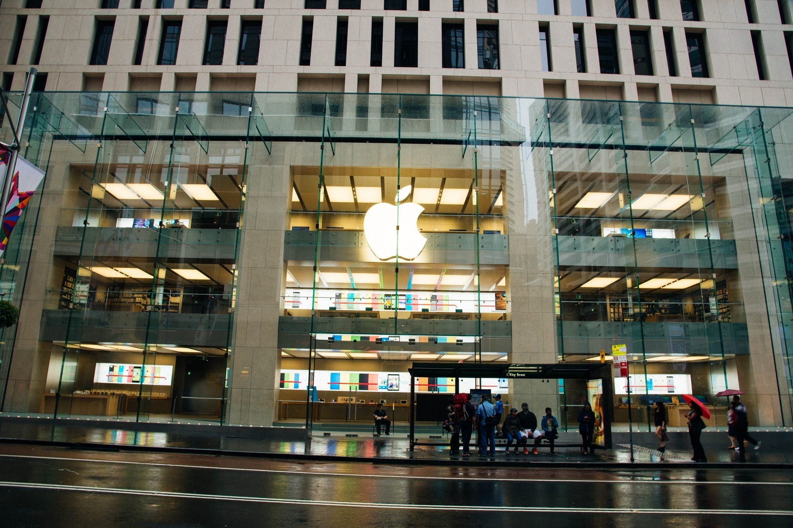

As the barriers to entry lower and become more accessible on the internet and in schools, more and more people will soon be able to learn how to program.

What will soon discern a good from a bad programmer is the ability to solve problems - effectively and efficiently. On top of that, a good hire will no longer be only those who can write code, but he must also know how to build a product.

The tale of a programmer-in-training cooping himself up in his man-cave with his thick book on C will soon be over. Building a truly great product requires interaction and the understanding human beings - to build the best experience possible.

In the future, the programmer that strives to care about people and their problems will only be one with any true direction at all.

All of us should work towards that.

