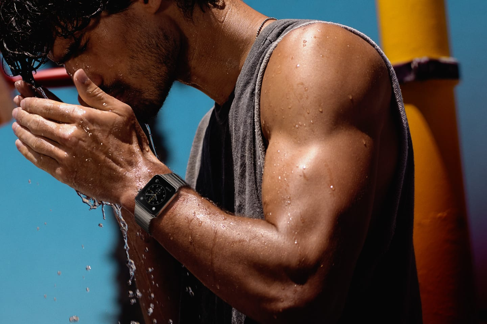

The following are notes I've taken on Day One, regarding the Apple wearable.

I'm a huge Apple fan and this upcoming Apple wearable has gotten me really excited. I wanted it to be more than just a glorified pager - something that'll make it less 'nerd-centric' and for the masses.

## Expectations
I read the [article](http://9to5mac.com/2014/01/31/iwatch-ios-8-apple-sets-out-to-redefine-mobile-health-fitness-tracking/) on 9to5mac on the movements within Apple on the development of this product and I wanted to watch to be so much.

Looking at HealthKit that has metrics like blood pressure and sugar levels got me so excited - what if the  Watch can be the device that monitors and files all these important vitals for your doctor?

Important health data collected once every blue moon now continuously being monitored. That's definitely going take us really far and we'll know when we really need to see a doctor. It will also help a doctor make better diagnosis.

An electronic consumer product that will finally be able to capture people of all ages - especially the older generation.

## The Show
I'm going to skip this bit - cold hard facts are boring.
If you want my reactions, you can take a look at my tweets as logged in [Day One](https://dayone.me/MiqzuM).
