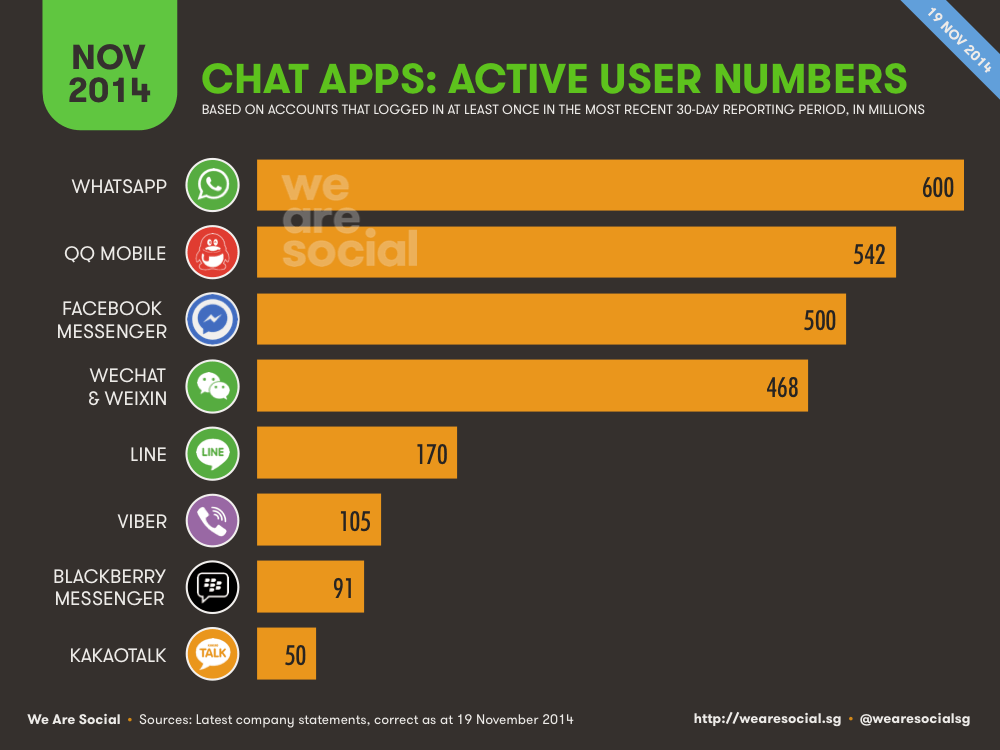

My friend and I were having coffee the other day and discussed about newer apps being more transient than the early birds. They tend to fade after 2 years in your devices and quite frankly, they're not bad apps at all.

The discussion then went on to the apps that have stayed, from when we first played with the iPhone until Android joining the market. WhatsApp, this one app stuck out the most for us - it's not /fantastic/ with any cool design metaphors or fancy interaction paradigms like Facebook Paper, but it has always been there.

The design for WhatsApp has remained the same, there wasn't too many design changes. Part of it's success was probably it fixates it's improvements into backends to keep downtime as low as [1%](http://qz.com/178897/a-hand-written-note-explains-the-radical-purity-driving-whatsapps-success/). BBM did a similar thing even before WhatsApp was around, but it got left behind the same way Microsoft got left behind in the mobile business - failure to anticipate changing tides.

David Sivers' great [post](http://sivers.org/multiply) on ideas versus execution:

> To make a business, you need to multiply the two. (ideas and execution)
The most brilliant idea, with no execution, is worth $20.
The most brilliant idea takes great execution to be worth $20,000,000.

The Apple Watch is soon to open up the wearables market - perhaps this is your chance to be at the forefront of the next epoch of computing, start now: https://developer.apple.com/watchkit/
