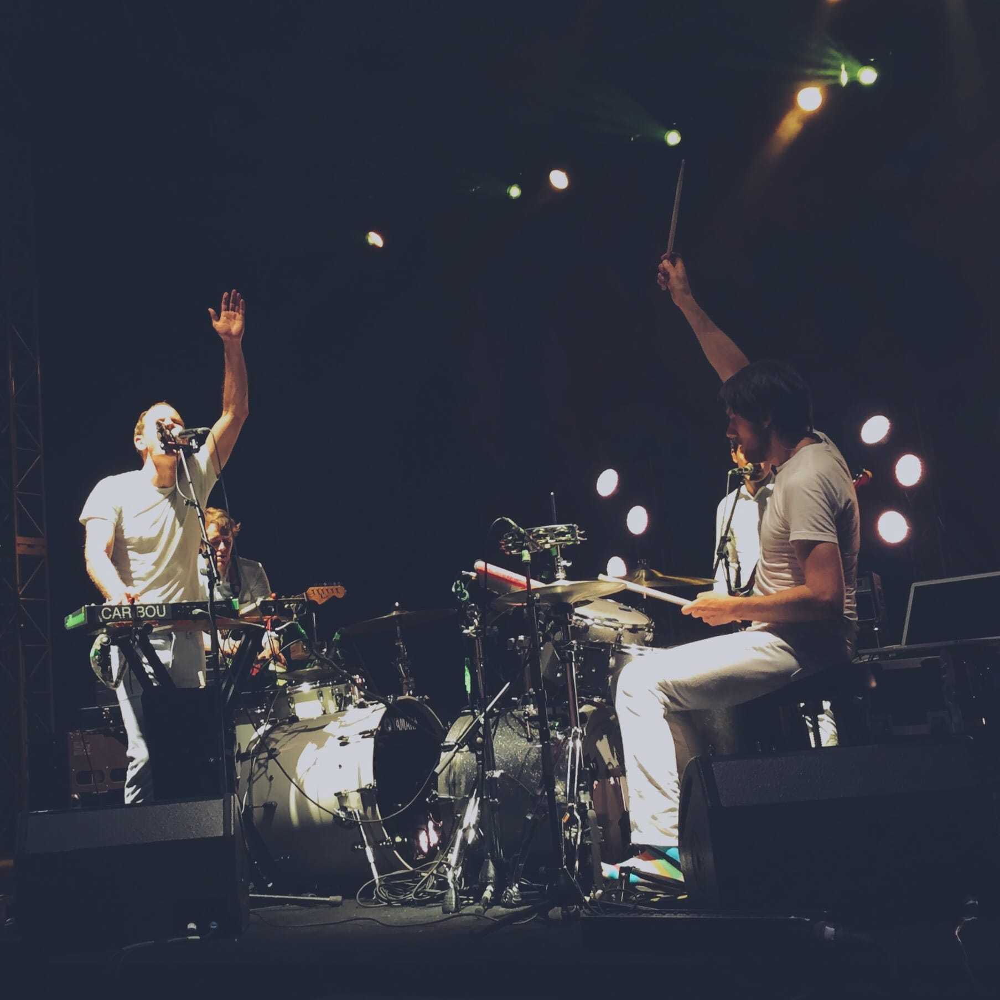

Thought I'd say this first: no I *will not* be writing about how happy I am to be single and mope about my romantic life like it's supposed to be a post on Thought Catalog. It might seem like I'm heading that direction, but I'm not, trust me.

I spent most of Valentine's Day at a music festival called "The Gathering", where some of my absolute favourite musicians played live: Charlie Lim, How To Dress Well, Caribou, Belle & Sebastian.

As far-fetched as it sounds, Valentine's Day reminds me about how love transcends beyond the known dimensions of this universe and reminds me that it is this emotion that keeps the world going. All 18 Valentine's Days I've gotten through I've done so without a partner, but I'm starting to really appreciate this day for what it *really* represents; what makes us all truly **happy**.

Being at The Gathering, especially during Caribou's and Belle & Sebastian's set, you could feel the passion and love for music just gushing out from these musicians with such endearing charm. I started to see the whole point of "love" as an emotion, despite the fact that you and I both know the world can really just keep spinning without humans feeling said emotion.

There and then, I saw people who loved what they were doing, people who spent no time moping but chose to take in the little things and people around them and fully appreciate it. They loved what they were doing so much, the fulfilment through the simplicity of allowing people to enjoy their music made them genuinely happy people.

As Stevie Jackson said in his AMA, "Lose your dreams and you lose your mind", it is sometimes our love, passion and expectations for people and things that keeps us going.

It is the things we love that we put before material success, and sometimes our lives, that can make us truly happy. I saw it that night in Fort Canning Park, and I see it when passing by every happy couple having a great time during Valentine's Day.

I had great music, great company and a great lesson to learn this Valentine's Day. It might not have been the Valentine's Day I wanted, but it sure was enough to be one that I never want to miss.

