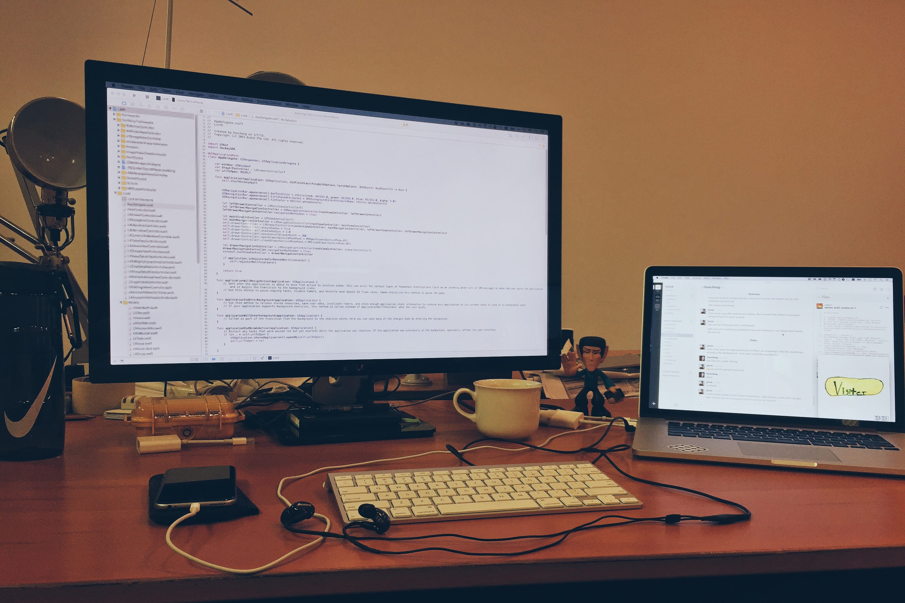

# "Do You Have A Life?"

Just last week, the holidays have begun. To many people, this is a great time, because they'd get a break from the stress of school; to finally enjoy their lives without concrete societal responsibilities.

On the other hand, I have opted to work back at buUuk as an iOS intern. I went without a break in between. Most people get really puzzled at my style – usually asking something along the lines of "do you have life?"

Uh, yes, and no?

To me, the whole point of being alive is to be given the opportunities to pursue and do the things you love - to continuously get better at them. In the more textbook sense, yes, I guess I don't really have a life.

**But I usually explain it this way:**

When you love something, like how you can like someone, you don't go a day without thinking of him/her. I mean, why will you?

-----
**Random Note:**

I'm heading to Bangkok over the rest of the week. Next week's post should be cool.
