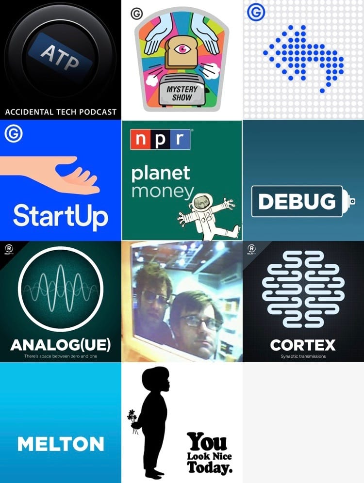

I consider myself a heavy consumer of podcasts - I listen to them while working, commuting on the train, eating breakfast, getting ready for school. Recently I noticed I have this massive build-up of podcast backlog, and the consequence of that is me _not_ dealing with the information overfload and ended up neglecting podcasts all together.

Here's my initial list:

1. Accidental Tech Podcast
2. Debug
3. Connected
4. Mystery Show
5. Planet Money
6. Reply All
7. Roderick On The Line
8. Analog(ue)
9. The Bugle
10. Build Phase
11. Developing Perspective
12. Melton
13. StartUp Podcast
14. Top Four
15. WTF with Marc Maron
16. Reconcilable Differences
17. Cortex
18. You Look Nice Today (I listen to the old episodes)

Some of you probably have more than that subscribed, but this was getting way too much for me, hence after trimming it down...

1. [Accidental Tech Podcast](http://atp.fm/)
2. [Mystery Show](https://gimletmedia.com/episode/case-6-kotter/)
3. [Reply All](https://gimletmedia.com/episode/43-the-law-that-sticks/)
4. [StartUp Podcast](https://gimletmedia.com/episode/15-married-to-your-business/)
5. [Planet Money](http://www.npr.org/sections/money/127413729/podcast/)
6. [Debug](http://www.imore.com/debug)
7. [Analog(ue)](https://www.relay.fm/analogue/63)
8. [Roderick On The Line](http://www.merlinmann.com/roderick/)
9. [Cortex](https://www.relay.fm/cortex)
10. [Melton](http://developingperspective.com)
11. [You Look Nice Today](http://developingperspective.com)

This makes me a lot more comfortable now. Hopefully I won't be adding more. There just are **too** many great podcasts out there vying for my attention these days.

-JT

