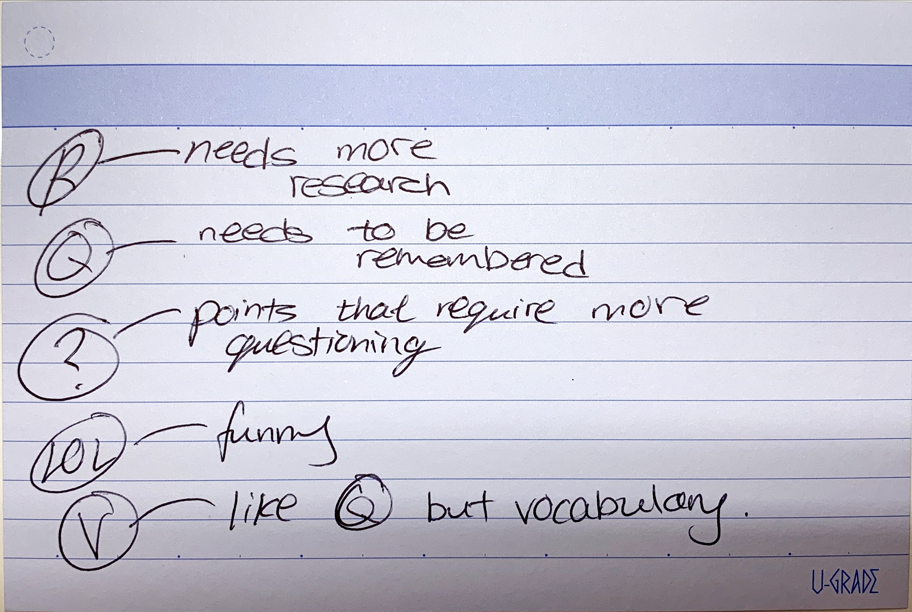

In 2019, I am making a personal commitment to improve my reading on the following fronts:
1. Information retention
2. Becoming more self-authored
3. Make more connections with material I engage with

Deep in the bowels of my Instapaper archives, I fished out two articles for reference: 
* Robert Heaton’s How To Read: https://robertheaton.com/2018/0625/how-to-read/
* Sirupsen’s How I Read: https://sirupsen.com/read/

They both committed to a format that looks something like this: 
1. Reading
2. Processing
3. Writing

## Reading/Consumption
### Highlights
Highlights is the easiest to do. I do it today, and have been doing it for a very long time. However, I have the “highlight and forget” syndrome. Which does not encourage information retention at any level.

Last year I started a commonplace book where I started recording down my highlights in index cards and mark them topically before transferring them into Evernote and shelving them into long-term storage.

Unfortunately, I never revisit these index cards unless I’m writing something (which unfortunately became rare as my time in service continued on). 

I want to change that.

On top of having highlights marked topically, they should also be categorised to the following: key to remember, needs more research, requires more questioning, funny. These symbols will then determine how they get processed (a system that will be discussed further down in this post).

Which brings us to the next system: the symbols to indicate them while reading a book.

### Symbols

* **Needs more research** — highlights that are interesting, but I’ll like to do more research on it. 
* **Needs to be remembered** — highlights that form the foundations of understanding an idea that is being put forth by the writer/speaker
* **Points that require more questioning** — Things that I find complicated to understand I will like to spend more time thinking about.
* **LOL** — just funny stuff I read/hear about; will probably send to my partner too
* **Vocabulary** — words that are new to me

### Chapter Summaries (Books Only)
I envision this to be the toughest piece out of the three to execute simply because it takes more time. However, after my experience of maintaining a commonplace book over the past year, it has further reinforce the need for a chapter summary to exist

While I end up with a large collection of highlights, more often than not I forget why I thought they were interesting at that point. These chapter summaries should chiefly highlight 2 things: 1. quickly outline what the chapter was about 2. biggest takeaway from the chapter.

Hopefully, chapter summaries will help me contextualise my highlights after reading a book; making it easier to do a writeup (which I will discuss in more detail in the “Writing” section below)

## Processing
Most of my processing workflow will surround the creation of flash cards. Depending on what my highlights are, they will invite a different treatment in this step.

|  | R | Q | ? | LOL | V |
|------------|--------------------------------------------------------------------|--------|--------------------------------------------------------------------|-----|------------------------|
| Anki | Research; then created depending if it's "memorisable" information | Copied | - | - | Copied with definition |
| AirTable | - | - | - | - | Copied with definition |
| Index Card | Research; then write new card | Copied | Research; then created depending if it's "memorisable" information | - | - |
| Evernote | Same as index card | Copied | Same as index card | - | Copied as Glossary |

## Writing
### A (Personal) Daily Reflection Journal
I have endeavored on this many times, but always struggled with “coming up with things to talk about”. To help give myself a bit of a leg up, I will be reading a book called “A Calendar of Wisdom” this year. This book features a collection of ancient and classic texts giving good, actionable advice from diverse schools of thought. It has a page for each day of the year, so I will be using it as a muse.

Each day’s entry will take the following format
1. Favorite quote
2. What I think the over-arching theme of the entry means to me.
3. Some actionable items I can apply to my day-to-day
4. An example of a recent occurrence on how the mentioned theme can help me improve myself

### Podcast Summaries
I have started doing this over time as I start listening to more and more intriguing ideas via podcast. Because of the transient nature of them, my notes typically just consist of either direct quotes or lightly synthesized/shortened versions of what a host will have said. 

My challenge to myself will be to append an additional summary at the bottom of the note consisting of the following:
1. What are the 3 biggest takeaways of this podcast?
2. For each of the takeaways, why do they mean so much to you?
3. How can the takeaways be relevant to your own life?
4. Come up with 1 question to ask the interviewee if you had the chance to talk to them

### Highlights and Notes Series
Late in 2018, I started this mini-series of notes on my Evernote I called “Highlights and Notes”. It started off as just a collection of highlights I have made in my physical books/Kindle as well as any pertinent notes I have written along the way. You can think of it as a single note consisting of information I have also written down on index cards.

This year, I will like to do more of this. Like [this post](http://blog.jurv.is/highlights-and-notes-antifragile-by-nassim-nicholas-taleb) on my blog, I will like to commit myself to selecting 10 key ideas and draw references from other things I have read. This will be hard, but I suspect it will be very worth it.
